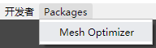
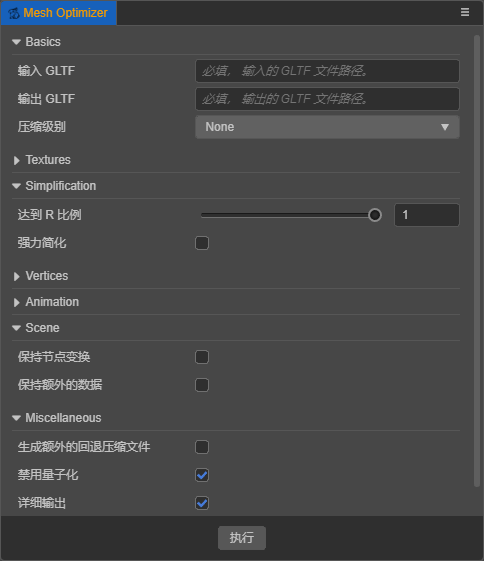
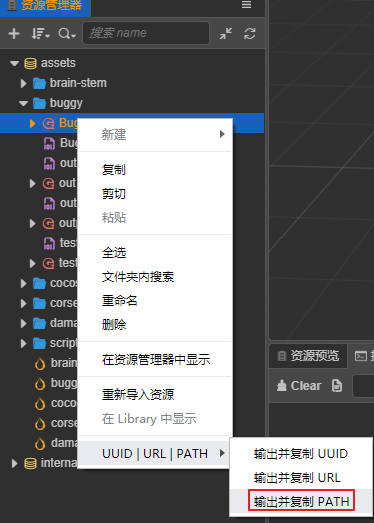
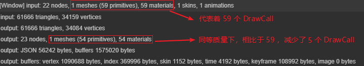

<!-- # 让模型渲染更快、网格更小的优化插件 -->

# 基于 Cocos Creator 3D v1.1 的模型优化插件

尽管目前还未开放编辑器插件开发的相关文档和细节，但其已具备了插件开发相关的基础功能，更多插件体系相关的细节和功能也正在积极的讨论和开发中，相信很快就可以和大家见面。

## 模型优化插件

这里基于`Cocos Creator 3D v1.1`为大家提供一个针对`gltf`模型优化相关的体验插件，它具有**提高渲染性能**、**简化模型顶点数和面数**、**压缩数据大小**等功能。对开发编辑器插件感兴趣的朋友也可以参考此插件的相应实现。

为更好的了解此插件的目的，这里翻译一段来自[meshoptimizer](https://github.com/zeux/meshoptimizer)的介绍：

**当`GPU`渲染三角形网格时，`GPU`流水线的各个阶段都要处理顶点和索引数据，这些阶段的效率取决于你提供给它们的数据;**

这段简明概要的介绍已经说明了此插件的主要目的：**优化渲染数据**，其中更多的详细介绍请参考[meshoptimizer](https://github.com/zeux/meshoptimizer)。

### 如何获取

预先需要: [git](https://git-scm.com/)

得益于强大的插件体系，使用方法特别的简单：

- 下载插件包[bundle](plugin_mesh-optimizer.zip)，熟悉`git`工作流的朋友也可以拉取这个[远端](https://github.com/JayceLai/plugin_mesh-optimizer)。
- 解压到以下目录中：
  1. \${user}/.CocosEditor3D/packages
  2. \${project}/packages
- 最后检验，打开编辑器，若在菜单项中看见`Packages/Mesh Optimizer`项，则说明插件安装成功。
  

注：`${user}`代表用户文件夹，`${project}`代表工程文件夹。
注：在`${user}/.CocosEditor3D/packages`中表示为全局插件，所有工程都可以使用。

### 如何使用

首先打开相应的面板：

#### 必填项

其中最主要的是`Basics`中的必填项：

| 必填项        | 解释                 |
| ------------- | -------------------- |
| **输入 GLTF** | 输入 GLTF 文件的路径 |
| **输出 GLTF** | 输出 GLTF 文件的路径 |

在填完以上选项后，点击`执行`按钮，将会生成相应优化过的`GLTF`文件。

#### 额外选项

部分额外展开的非必填项：

| 部分非必填项    | 解释                                  |
| --------------- | ------------------------------------- |
| **压缩级别**    | None 无压缩;Normal 一般;Higher 高程度 |
| **达到 R 比例** | 简化比率，范围`[0, 1]`，越小简化越大  |
| **强力简化**    | 不管质量如何，简化到目标比率          |
| **禁用量子化**  | 禁止使用[KHR_mesh_quantization](https://github.com/KhronosGroup/glTF/tree/master/extensions/2.0/Khronos/KHR_mesh_quantization) 扩展  |
| **详细输出**    | 输出详细的数据信息                    |

注：由于暂不支持`KHR_mesh_quantization`扩展，在编辑器中使用的`gltf`模型目前必须开启**禁用量子化**。
注：其它选项目前建议使用默认值，如果有更高的要求可以根据需求修改，相关介绍参考[这里](https://github.com/zeux/meshoptimizer)。

### 最佳实践

- 快速复制编辑器内文件路径：
  

- 将输出文件路径设置到同目录下
  例如输入文件路径为：`D:\mesh_opt\assets\buggy\Buggy.gltf`，则将输出文件路径设置为`D:\mesh_opt\assets\buggy\` + `${输出文件名称}.gltf`，这样的好处是可以共享纹理图片资源

- 开启详细输出，通过输出信息可以分析优化的程度
  

注：图片资源不会拷贝到输出目录中，所以建议输入文件和输出文件在同一目录下。
注：此插件为体验性质，目前仅测试了部分模型，其中测试的模型均得到了相应的数据优化，请开发者谨慎使用。

**最后，恳请大家尝试体验，也恳请为我们提供宝贵的建议或者是 BUG 反馈，以及感兴趣的朋友可以一起参与贡献，如果觉得不错也请分享给更多的朋友，谢谢**。
